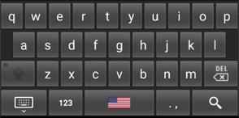
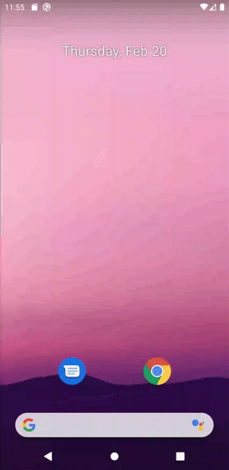

<div align="center">
<h1>Soft Keyboard<br/><sub>Resurrecting the old keyboard for API 21+</sub></h1>



```text
"Useful on emulators that need a keyboard which does not contain a legal First Run Experience, like Gboard."
```

[](https://github.com/upmc-enterprises/softkeyboard/actions) [](https://github.com/upmc-enterprises/softkeyboard/releases)

<hr />
</div>

## Example on API 29

Since this example keyboard doesn't ship on Android emulators past API 27, here is a demo showing it work on API 29 using this project.

<div align="center">


</div>

## Usage

Navigate to the [releases tab](https://github.com/upmc-enterprises/softkeyboard/releases) to find the latest APK for use in your environment. The source code has been kept as close to [the original](https://github.com/Miserlou/Android-SDK-Samples/tree/master/SoftKeyboard) as possible for the sake of consistency.

A sister project to this, the [Android Emulator Builder](https://github.com/upmc-enterprises/android-emulator-builder), uses the APK from this project to automatically stand up an emulator and bypass the legal prompts shown by Gboard on the first run. Instead of using Gboard, it installs this application as the default keyboard, which doesn't have any on-boarding prompts. More information on this technique, and on other ways of automatically setting up an Android emulator, is available [on our article on ProAndroidDev](https://proandroiddev.com/automated-android-emulator-setup-and-configuration-23accc11a325).

<br>
<hr />
<br>
<br>

<div align="center">
<p>This project was inspired by a need for the <a href="https://myupmc.upmc.com" target="_blank">MyUPMC</a> project at <a href="https://enterprises.upmc.com" target="_blank">UPMC Enterprises</a></p>

<a href="https://myupmc.upmc.com" target="_blank">
    
</a>

<a href="https://enterprises.upmc.com" target="_blank">
    
</a>
</div>
